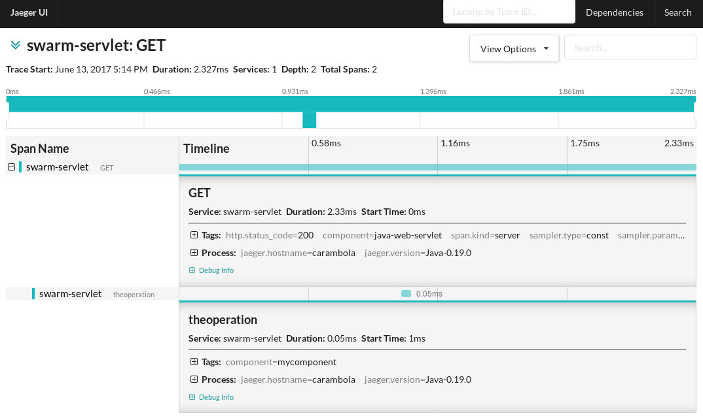

= Wildfly Swarm with OpenTracing (and Jaeger) - Servlet

This is a Wildfly Swarm example for OpenTracing integration using Jaeger Tracer. The application
is a simple Servlet and the transparent framework integration is responsible for creating a span for each request.
The Servlet itself later creates a "business span", which is a child of the request span.

= How to build

```bash
mvn clean install
```

= How to run

The example uses the `TraceResolver` feature from OpenTracing, which causes Jaeger to make a default Tracer available.
This default tracer can be configured via environment variables, such as `JAEGER_SERVICE_NAME`, `JAEGER_SAMPLER_TYPE`, 
`JAEGER_SAMPLER_PARAM` and so on. The service name environment variable is the only one required.

As such, this is the simplest command to be executed to get this example working:
```bash
JAEGER_SERVICE_NAME=swarm-servlet mvn wildfly-swarm:run
```

To instruct Jaeger Tracer to sample all incoming requests, the following can be used:
```bash
JAEGER_SAMPLER_TYPE=const JAEGER_SAMPLER_PARAM=1 JAEGER_SERVICE_NAME=swarm-servlet mvn wildfly-swarm:run
```

Look at the Jaeger's Core module for a complete list of available environment variables.

Once the example is running, make `GET` calls to `http://localhost:8080/hello` in order to create spans:

```bash
curl -v localhost:8080/hello
```

The spans look like this on Jaeger:



== I don't have a Jaeger instance (yet!)

All you need is Docker:

```bash
docker run \
    --rm \
    -p5775:5775/udp \
    -p6831:6831/udp \
    -p6832:6832/udp \
    -p5778:5778 \
    -p16686:16686 \
    -p14268:14268 \
    --name=jaeger \
    jaegertracing/all-in-one:latest
```